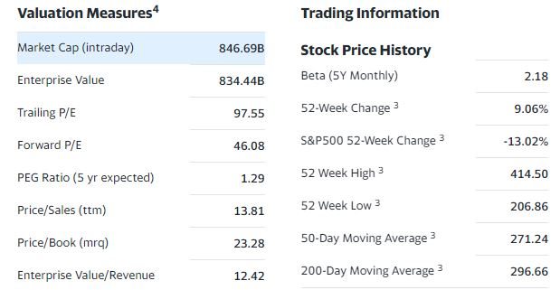

# Part 1 Web scrapper:

The web scrapper in BeautifulSoup 4 takes scraps info from the yahoo finance statistics page.

The two sets of data to be scrapped consists of the S&P constituents and one's personal portfolio.

# Part 2 S&P and personal portfolio segment analysis with recommendations:

This script performs a K means clustering on the S&P consituents to determine different groups of companies/assets. 
The following features are used in K means clustering:
1. Market cap
2. Revenue
3. Profit Margin
4. 52 Week Change

It then compares it with one's portfolio for recommendation for diversification.

