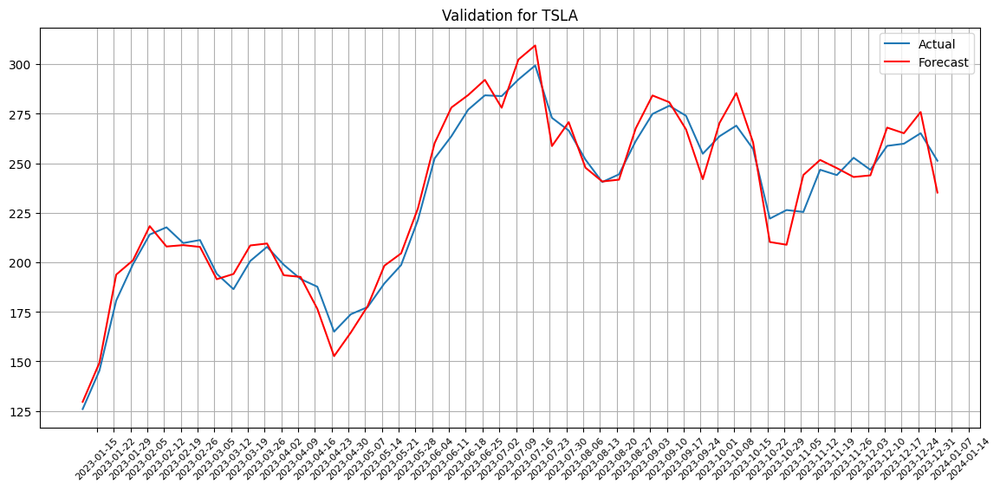
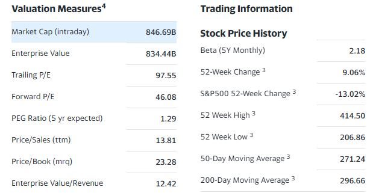

## Upcoming works
1. Consider if Pydantic would be useful here, if so, try it out
2. Consider other databases (DuckDB, PostgresSQL)
3. Add RMSE or other metrics into TS validation
4. Optimize for SARIMA parameters

# Part 1 Time Series analysis and forecasting:
This script aims to perform SARIMA to analyse stock prices and forecast into the future with the following purposes:
1. Identify near-term price movement trends
2. Determine optimal actions for maximum gain

# Part 2 Web scrapper:

The web scrapper utilises BeautifulSoup 4 to scrap info from the yahoo finance statistics page.

Two sets of data are utilized: S&P constituents and a personal portfolio.

# Part 3 S&P and personal portfolio segment analysis with recommendations:

This script performs a K-means clustering on the S&P constituents to determine different groups of companies. 
The following features are used in K means clustering:
1. Market cap
2. Revenue
3. Profit Margin
4. 52 Week Change
5. Quarterly Earnings Growth (yoy)

The identified clusters are compared with one's portfolio for comparison.

## Improvement logs:
20240108:
1. Modularising Forecaster on notebook
2. Added functions to 
    - forecast
    - validate forecast
    - plot forecast
    - determine single buy and sell for maximum profit within forecast

20240107:
1. Completed modularisation of YfScrapper
2. Completed learning on time series (ARIMA, SARIMA)

20240103:
1. Refactored code and directory to modularise scrapper
2. Renamed project

